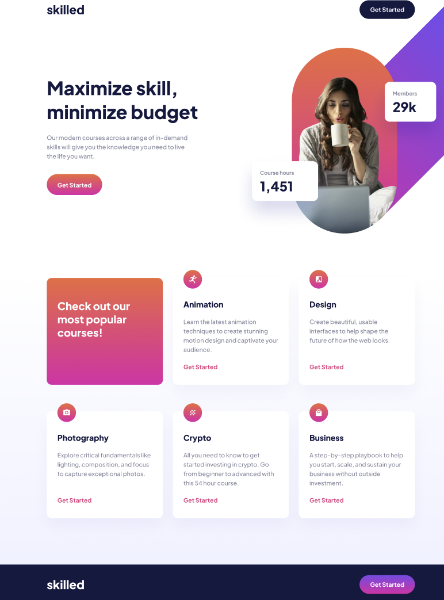

# Frontend Mentor - Skilled e-learning landing page solution

This is a solution to the [Skilled e-learning landing page challenge on Frontend Mentor](https://www.frontendmentor.io/challenges/skilled-elearning-landing-page-S1ObDrZ8q). Frontend Mentor challenges help me to improve my coding skills by building realistic projects.

### Screenshot

### Links

- Live Site URL: ([https://shorenatsiklauri.github.io/skilled-elearning-landing-page/])

## My process

### Built with

- Semantic HTML5 markup
- CSS custom properties
- Flexbox
- responsive design

### What I learned

HTML
CSS
responsive design
